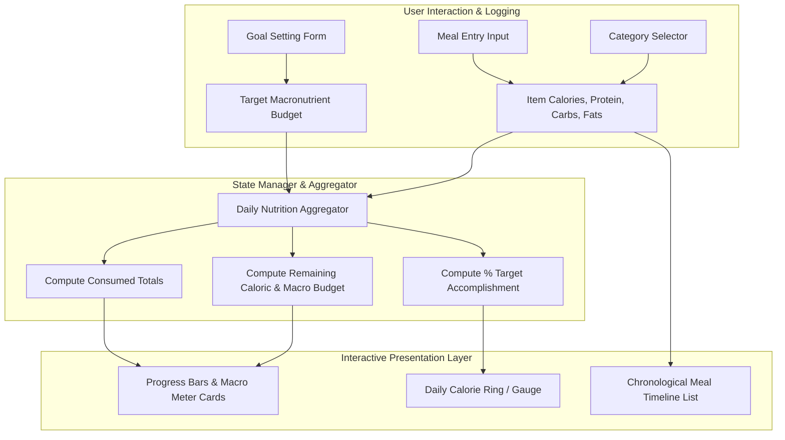

<div align="center">

# 🥗 MEALMASTER (DIET APP)
### Minimalist Daily Nutrition, Macro Tracker & Calorie Dashboard

[](https://697e1aedf75478204956edac--gilded-chaja-11a5c3.netlify.app)
[](https://reactjs.org/)
[](https://vitejs.dev/)
[](https://tailwindcss.com/)
[](https://opensource.org/licenses/MIT)

<p align="center">
  <b>MealMaster</b> is a lightweight, responsive dietary management web application crafted to streamline personal nutrition tracking. Built with a focused, clutter-free terminal-inspired aesthetic, it allows users to set daily dietary targets, log meals seamlessly, and visualize macronutrient balances without the bloated overhead of commercial fitness trackers.
</p>

[🚀 Live Demo](https://697e1aedf75478204956edac--gilded-chaja-11a5c3.netlify.app) • [✨ Key Features](#-key-features) • [🏛️ Architecture](#-system-architecture) • [🛠️ Tech Stack](#️-tech-stack) • [📦 Quickstart](#-quickstart-guide) • [📁 Structure](#-project-structure)

</div>

---

## 🌟 Key Features

* **🎯 Dynamic Target & Goal Setting**: Configure personalized daily caloric intakes and target split ratios for proteins, carbohydrates, and fats.
* **🍽️ Categorized Meal Logging**: Log foods categorized across Breakfast, Lunch, Dinner, and Snacks with instantaneous nutritional total updates.
* **📊 Macro Balance Visualizer**: Dynamic visual progress meters and charts illustrating macro breakdown and remaining calorie budgets for the day.
* **⚡ Terminal-Brutalist Dark Mode**: High-contrast, sleek dark-themed interface built for reduced eye strain and maximum visual clarity.
* **📱 100% Mobile & Desktop Responsive**: Fluid CSS grid and flexbox layout optimized for fast entry whether on your phone in the kitchen or on your desktop.

---

## 🏛️ System Architecture



---

## 🛠️ Tech Stack

| Layer | Technology |
| :--- | :--- |
| **Frontend Framework** | React.js (Single Page Application) |
| **Build Tool** | Vite (Ultra-fast development & production bundling) |
| **Styling** | Tailwind CSS with dark-mode aesthetic |
| **Hosting & CI/CD** | Netlify Continuous Deployment |
| **Code Quality** | ESLint 9 |

---

## 🚀 Quickstart Guide

### Prerequisites
* **Node.js 18.x or higher**
* **npm** or **yarn / pnpm**

### 1. Clone the Repository
```bash
git clone https://github.com/harinarayana1457-cmyk/DIET_APP.git
cd DIET_APP
```

### 2. Install Dependencies
```bash
npm install
```

### 3. Run Development Server
```bash
npm run dev
```
Open `http://localhost:5173` in your browser to view the application.

### 4. Build for Production
```bash
npm run build
```
The compiled, production-ready static assets will be output to the `dist/` directory.

---

## 📁 Project Structure

```text
DIET_APP/
├── index.html                # HTML entrypoint
├── package.json              # Project metadata & dependencies
├── vite.config.js            # Vite configuration
├── eslint.config.js          # ESLint rules configuration
├── .gitignore                # Repository ignore rules
└── README.md                 # Project documentation
```

---

## 🔗 Connect & Links

* **Live Demo**: [MealMaster on Netlify](https://697e1aedf75478204956edac--gilded-chaja-11a5c3.netlify.app)
* **Author**: [Hari Narayana (@harinarayana1457-cmyk)](https://github.com/harinarayana1457-cmyk)
* **LinkedIn**: [](https://www.linkedin.com/in/hari-narayana-035ba1389/)
